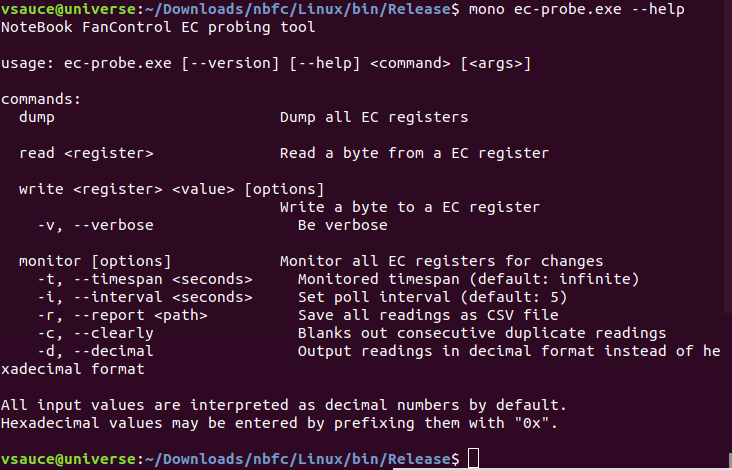
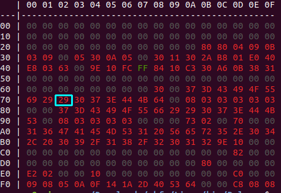
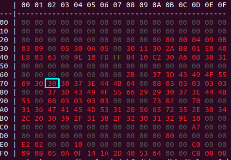

# MSI GE60 0ND Fan Issue Fix for Linux
> PS: If you dont wanna hear the story, just jump directly to the [Solution](#solution)
## Story

If you land here, you might have struggeled (or still struggling) with MSI Fan issue, which the speed continously increase and decrease and cause disturbing sound, expecially when you wanna be in silent mode in library.

Anyways. At the beginning, I researched about bios update and found one. But could not manage to apply. It may failed due my wrong application and might end up fixing eventually. But at the end I stopped cuz I was bored and was worrying to damage my computer since I could not get a backup at that time.

So I went for software solution. I find out there is one called [RWEverything](http://rweverything.com/) for Windows, which was awesome cuz my main OS was Win.

But eventually, I wanted move to Linux. If any of you tried Only Linux Mod (non dual boot), you might noticed that Wireless and Bluetooth devices wont work after install or later on.And fan boost key as well.They become **hardware lock** and I tried possible way that I found but did not worked. At least that is what happened to me.

Finally found tool for it. It is called [NoteBook FanControl aka NBFC](https://github.com/hirschmann/nbfc/) by Her Stefan Hirschmann 
> Danke für die Projekt
 


## Solution
My Linux distro is Ubuntu 18.04.1 LTS 64 bit. I can only verify on that. And I should remind you that this following progress is done for myself. You may create you way.
```bash
sudo apt-get install git #incase you might not have it

git clone https://github.com/hirschmann/nbfc.git
cd nbfc
#As the project owner defined on wiki, ubuntu's mono version might be old.
#Thats why we add official mono project's repo.
sudo apt-key adv --keyserver hkp://keyserver.ubuntu.com:80 --recv-keys 3FA7E0328081BFF6A14DA29AA6A19B38D3D831EF
echo "deb https://download.mono-project.com/repo/ubuntu stable-bionic main" | sudo tee /etc/apt/sources.list.d/mono-official-stable.list
sudo apt update
sudo apt install mono-complete
```
I got 3 warnings when I used `xbuild` which is used in `build.sh` at the end. While building, mono suggests `msbuild`. Thats why I changed it to that and warnings were gone. I do not know what are the difference but I prefer to change. 

If you want to change as well, edit `build.sh`'s where `xbuild` is used and exchange it with `msbuild`.

```bash
sudo ./build.sh
```

Now, lets fix the fan issue. Before we get into that I should inform you where we need to fix and how I got that information.

I do not recall the person but while researching for RWEverything about which section to change, THE PERSON told that
>On MSI GE60 0ND, the issue is being caused by Row 70, Col 02. It needs to be 30 but in BIOS, MSI left it 29.

So for me, that section is fixing my problem. I hope it does for you as well. If it is not and you are not sure where to fix it, research about it.

**ec-probe.exe --help**


```bash
cd nbfc/Linux/bin/Release
mono ec-probe.exe dump #to analyze current data
```

Registers are numbered from left to right and starts from 0.
Our register is on 7th row and 3rd column; `16*7+2` = `114`
> to be sure, first use read to verify if it is the correct register. Do +3 & -3 as range to be sure.

```bash
sudo mono ec-probe.exe read 114 #to read certain location
```

```bash
sudo mono ec-probe.exe write 114 0x30 #to write certain value
```
**DONE!**

### Before



### After


## Conclusion

I am happy to have silence. Thanks for both RWEverythink and NBFC.

I *WISH* all computer manufacturers design their products to support fully Linux in near future...

A Reminder;
>These scripts are prepared just for myself. Please check before using them. I am not responsible if anything bad happens. Use at your own RISK!

## LICENSE

FELL FREE TO EDIT AND SHARE, THEY ARE JUST SCRIPTS. CREDITS AND LICENSE RULES ARE APPLIED FOR INDIVIDUAL TOOLS HOW THEIR AUTHORS DESCRIBED!